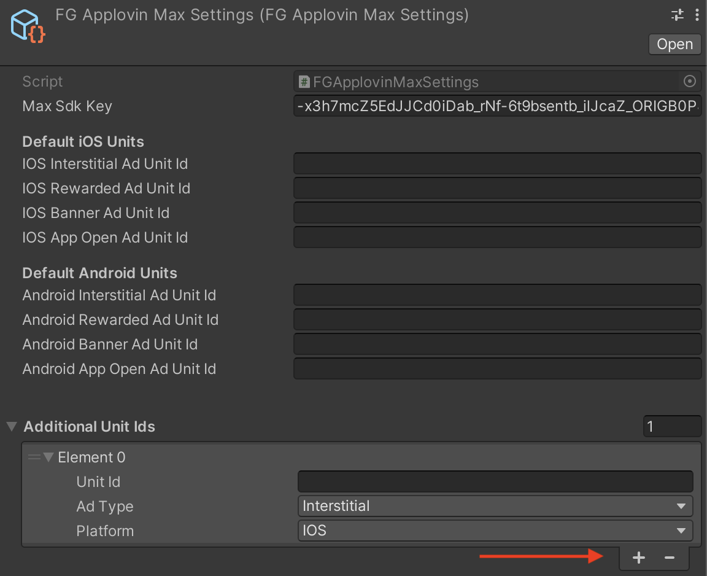

# Applovin Max

## Integration Steps

1) **"Install"** or **"Upload"** FG ApplovinMax plugin from the FunGames Integration Manager or download it from <a href="https://drive.google.com/uc?export=download&id=1ztBMbYu2ArP3R-i3PQOI9fHAfVjBV_wz" target="_blank">here</a>.

2) Follow the instructions in the **"Install External Plugin"** section to import ApplovinMax SDK.

3) Click on the **"Prefabs and Settings"** button in the FunGames Integration Manager to fill up your scene with required components and create the Settings asset.

4) Follow the **Account and Settings** section.

5) To finish your integration, install the mandatory ad networks according to the **Install mediation networks** section.

## Install External Plugin

After importing the FG ApplovinMax module from the Integration Manager window, you will find the last compatible version of ApplovinMax SDK in the _Assets > FunGames_Externals > Mediation_ folder. Double click on the .unitypackage file to install it.

If you wish to install a newest version of their SDK, you can also download the <a href="https://dash.applovin.com/documentation/mediation/unity/getting-started/integrationhttps:/dash.applovin.com/documentation/mediation/unity/getting-started/integration" target="_blank">Max Unity Plugin</a>.

**Note that the versions of included external SDKs are the latest tested and approved by our development team. We recommend using these versions to avoid any type of discrepencies. If, for any reason, you already have a different version of the plugin installed in your project that you wish to keep, please advise our dev team.**


## Account and Settings

You can configure Applovin Max through the **Applovin Integration Manager** (in the menu toolbar Applovin -> Integration Manager) . 

Enable MAX Ad Review in the AppLovin Quality Service section. 

For the ads to work you need to go to the **FG ApplovinMax Settings** (_Assets > Resources > FunGames > FGApplovinMaxSettings_) and fill in the different keys. To do so you need to follow these steps:

- Create a build, just initializing the Sdk (without the Ad Units Id) and run it on
your device (real device)
- The ad unit ids will then be created on our backend. You need to ask the publishing
team for those ad unit ids.
- Once you have those units ids, please integrate them in the FGMax Settings in the
Ressource Folder.
- When you Ad Unit Ids are correctly setup, you can built and run your app on a mobile device to test their integration.
- You can also use the Max Debugger to display information about your Max configuration in game by calling the MaxSdk.ShowMediationDebugger() function.

## Install mediation networks

Now that ApplovinMax is properly set up through FG SDK, you will be able to install all the Ad networks from the **Applovin Integration Manager**.

This is the list of mandatory networks you will need to integrate :

- Admob
- Google Ad Manager
- Meta Audience Network
- DT Exchange
- IronSource
- LiftOff Monetize
- Pangle
- InMobi
- Mintegral
- Unity Ads
- Verve

Some of these networks will require some specific instructions to be properly installed. Please check the <a href=" https://dash.applovin.com/documentation/mediation/unity/mediation-adapters" target="_blank">Applovin Documention</a> to make sure everything is well setup in your project.

# Amazon with Max

## Integration Steps

1) **"Install"** or **"Upload"** FG Amazon plugin from the FunGames Integration Manager.

2) Follow the instructions in the **"Install External Plugin"** section to import Amazon SDK.

3) Click on the **"Prefabs and Settings"** button in the FunGames Integration Manager to fill up your scene with required components and create the Settings asset.

4) To finish your integration, follow the **Account and Settings** section.

## Install External Plugin

After importing the FG Amazon module from the Integration Manager window, you will find the last compatible version of Amazon SDK in the _Assets > FunGames_Externals > Mediation_ folder. Double click on the .unitypackage file to install it.

Once Amazon SDK is installed, you will also need to Install the adapter for ApplovinMax. You can do it through the Amazon SDK Manager (_Unity toolbar > Amazon > Manage SDKs..._)


## Account and Settings

Ask your Publisher to create your app on the APS account and to provide you the credentials for your app.

Once done, add your app Keys and Ad Ids to the **FG Amazon Settings** (_Assets > Resources > FunGames > FGAmazonSettings_).

## Build specifications

### Android

```csharp
<activity android:name="com.amazon.device.ads.DTBInterstitialActivity"/>
<activity android:name="com.amazon.device.ads.DTBAdActivity"/>`
```

For Amazon integration, you will also need to add these lines under the `<application>` section of your manifest file:

### IOS

When building your project for iOS, you might need to add DTBIOSSDK.xcframework manually to your Xcode Workspace. To do so, select Unity-iPhone target in XCode, open _General_ section, and add it using the "+" button in _Frameworks, Libraries and Embedded Content_.


You will also have to disable Bitcode in the _Build Settings_ of your XCode project.


# AppOpen

AppOpen is a recent feature from Applovin MAX SDK that enables to display Ads on app init or when the app was in background and opened again. 

Contrary to other type of Ads, AppOpen is triggered automatically in FG sdk (no need to call the "Show" function) according to some conditions that can be set by code.

By default we defined 3 conditions and 2 of them can be handled directly with RemoteConfig values:

- AppOpen will never be displayed at first connection
- AppOpen frequency can be set using the **AppOpenFrequency** remote config. (ex : if AppOpenFrequency is set to 1, an ad will be displayed at every OnApplicationPause(false) call. If its set to 2, then the ad will be displayed every 2 OnApplicationPause(false) calls, etc.)
- AppOpen cooldown can be set using the **AppOpenCooldown** remote config. (ex : if AppOpenCooldown is set to 30, AppOpen ads will only display if no other AppOpen ad was shown in the last 30sec)

All these condition are combined through an AND operator, so that AppOpen Ad is displayed only if ALL conditions matches.

You can also add your custom conditions using the _FGMediation.AddAppOpenCondition(...)_ method.

To learn more about AppOpen best practices please refer to the <a href="https://dash.applovin.com/documentation/mediation/ios/ad-formats/app-open" target="_blank">Applovin MAX documentation</a>.

# Multiple Ad Units
> 

Since FGApplovinMax v3.2.2, if you want to use multiple Ad Unit IDs in your Ad mediation, you can add it to the FGApplovinMaxSettings.

You will then be able to show an ad with specific AdId using the _FGMediation.ShowInterstitialWithId_ , _FGMediation.ShowRewardedWithId_ and _FGMediation.ShowBannerWithId_ methods.

When showing an Ad with a given UnitID, if no ad from the specific ID is ready (loaded), the SDK will use the default UnitID instead, to maximise the chances to get impressions from this placement.

# CHANGELOG

## Version 3.2.10 (21/08/2023)

### Updated

* Update to new Consent flow (FGMain 3.2.17)

## Version 3.2.9 (21/07/2023)

### Added

* Add Remote Config to send WaterFall API events to FirebaseAnalytics

### Fixed

* Fix ad placement names in Analytics events

## Version 3.2.8 (15/05/2023)

### Updated

* Improve Banner flow to handle show/hide when a new banner is loaded

### Fixed

* Fix issue with GA Ad events not being sent


## Version 3.2.7 (02/05/2023)

### Added

* Mrec implementation is now available through FGMediation
* Ad loading flow can now be controlled through Remote Config

### Updated

* Mediation module refactoring


## Version 3.2.6 (04/04/2023)

### Added

* Send "AdLoadingTime" events for each Ad Type

## Version 3.2.5 (30/03/2023)

### Fixed

* Fix OnBannerAdImpression event not triggered properly with MaxSdkCallbacks.Banner.OnAdRevenuePaidEvent callback.

## Version 3.2.4 (22/02/2023)

### Fixed

* remove Duplication of FG Analytics events when Multiple Ad Unit Id are set for the same Ad Type

## Version 3.2.3 (21/02/2023)

### Added

* Send Analytics Events for each Networks  with version number
* Remove Ads through FunGamesSDK parameter

## Version 3.2.2 (08/02/2023)

### Added

* Multiple Ad unit integration

## Version 3.2.1 (03/02/2023)

### Added

* AppOpen integration

### Updated

* Update GDPR Consent flow
* Update to Applovin Max SDK v5.6.7

## Version 3.2 (13/01/2023)

### Updated

* Update architecture for 3.2
